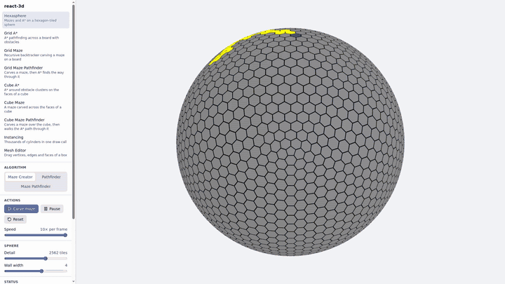

# react-3d

Maze generation and pathfinding, visualised in 3D with [three.js](https://threejs.org/) and
[@react-three/fiber](https://docs.pmnd.rs/react-three-fiber). Pick a scene in the sidebar; each
scene has its own controls, and every URL hash (`#/grid-astar`) is a link to that scene.

[](docs/promo.mp4)

_Preview at 2× speed. Click it for the full 20-second video._

| Scene                | What it shows                                                                                   |
| -------------------- | ----------------------------------------------------------------------------------------------- |
| Hexasphere           | A hexagon-tiled sphere: A\* with painted obstacles, a random maze, or a precomputed maze solved |
| Grid A\*             | A\* on a flat board with random or painted obstacles and a tracker that walks the path          |
| Grid Maze            | Recursive-backtracker maze on the board                                                         |
| Grid Maze Pathfinder | Carve a maze, then let A\* solve it                                                             |
| Cube A\*             | A\* across the faces of a cube; the cube turns to follow the search and can unfold into a net   |
| Cube Maze            | A maze that crosses cube edges                                                                  |
| Cube Maze Pathfinder | Maze, then A\*, then the tracker, across the cube                                               |
| Instancing           | Thousands of cylinders in one draw call, optionally animated                                    |
| Mesh Editor          | Select vertices, edges or faces of a box and drag them with a gizmo                             |

Common controls: Start / Pause / Reset with a speed slider, camera presets, grid and axes helpers.
Press `Esc` to leave any placing or painting mode and orbit again.

## Getting started

Requires Node.js 24 (`.nvmrc`) and pnpm 11 (`packageManager` in `package.json`).

```bash
pnpm install
pnpm dev        # http://localhost:3000
```

## Scripts

| Command             | Purpose                       |
| ------------------- | ----------------------------- |
| `pnpm dev`          | Vite dev server on port 3000  |
| `pnpm build`        | Production build to `dist/`   |
| `pnpm preview`      | Serve the production build    |
| `pnpm typecheck`    | TypeScript                    |
| `pnpm lint`         | oxlint (type-aware)           |
| `pnpm test`         | Vitest                        |
| `pnpm format`       | Prettier (write)              |
| `pnpm format:check` | Prettier (check only)         |
| `pnpm secrets:scan` | gitleaks over the git history |

## Deploy

The site is a static build hosted on Cloudflare Pages: build command `pnpm build`, output
directory `dist`. Pages picks up Node from `.nvmrc` and pnpm from `packageManager`. Don't set
`NODE_ENV=production` in the Pages environment, because pnpm then skips devDependencies and Vite
is missing at build time.

Response headers (the CSP, which allows Cloudflare Web Analytics, and the cache rules) live in
`public/_headers`, which Vite copies into `dist/`.

See `AGENTS.md` for the code layout and conventions.
